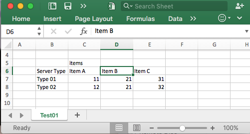
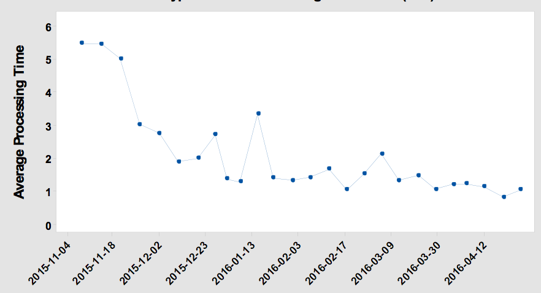

# merge-excel
To merge the specific table or columns from regular excel report to a excel.

## Background

We have recived a excel report weekly, each excel have same sheet name and column name. 



They are named with a datatime. I was be ask to find out the specific date in many this kinds of report and gennerate a time	 series polt, may be like this:



So I code this script to merge the specific columns from a set of excel. The output can be used to gengerate polt map.

## Usage

```
(ENV) Mac% python merge_excel.py -d test_data -s Test01 -c "Server Type" -c "Item A" -c "Item C"
Input dir is  test_data
Sheet Name is  Test01
Colume have  ['Server Type', 'Item A', 'Item C']
check files in test_data
- test_data/2015_11_04-test_excel_sheet.xlsx
- test_data/2015_11_05-test_excel_sheet.xlsx
(ENV) Mac%
```

- `d` the excel folder, remember that the excel must have date time formated with YYYY MM DD in filename
- `s` the sheet name.
- `c` the colunme name.

Output will be csv and json.

```
[
    {
        "Date": "2015-11-04",
        "Item A": 11,
        "Item C": 31,
        "Server Type": "Type 01"
    },
    {
        "Date": "2015-11-04",
        "Item A": 12,
        "Item C": 32,
        "Server Type": "Type 02"
    },
    {
        "Date": "2015-11-05",
        "Item A": 11,
        "Item C": 31,
        "Server Type": "Type 01"
    },
    {
        "Date": "2015-11-05",
        "Item A": 12,
        "Item C": 32,
        "Server Type": "Type 02"
    }
]
```
